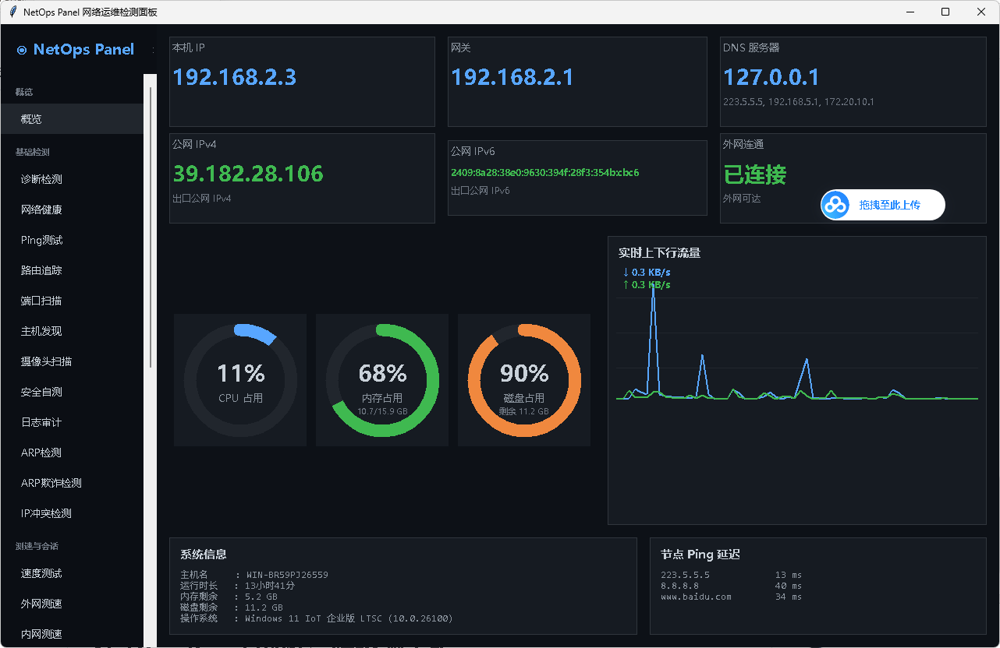

# NetOps Panel 网络运维检测面板

深色科技风格的 Windows 桌面网络运维工具，左侧竖向导航菜单 + 右侧卡片式工作台布局。
打包为**单文件 exe**，双击即用，无需安装 Python 或任何依赖。

## 界面预览



## 功能特性

### 首页工作台
- 本机 IP / 网关 / DNS / 外网连通性卡片，各节点 Ping 延迟
- CPU / 内存 / 磁盘占用环形仪表盘
- 实时上下行流量曲线图
- 系统信息：主机名、运行时长、内存剩余、磁盘剩余（正确识别 Windows 10/11）

### 基础检测
| 模块 | 说明 |
|---|---|
| 诊断检测 | 一键综合诊断外网连通性 |
| 网络健康 | 本机 IP/网关/DNS 与外网连通综合检测 |
| Ping 测试 | Windows 原生 ping 延迟检测 |
| 路由追踪 | tracert 逐跳实时滚动显示 |
| 端口扫描 | 多线程 TCP 扫描常用端口 |
| 主机发现 | ping + TCP 端口探测 + ARP 三合一（可发现禁 ICMP 的 Windows 主机） |
| 摄像头扫描 | RTSP/HTTP 常见端口探测 |
| 安全自测 | 防火墙等基础安全状态检查 |
| 日志审计 | 全局检测日志汇总与回放 |
| IP 冲突检测 | 基于 ARP 表检测重复 IP |

### 测速与会话
| 模块 | 说明 |
|---|---|
| 速度测试 / 外网测速 | 下载测试文件估算带宽 |
| 内网测速 | **内嵌 iperf3 客户端**，主动连接内网 iperf 服务端测速（下载/上传、TCP/UDP） |
| 会话测试 | 反复 TCP 连接统计成功率与延迟 |

### 分析与抓包
- 网络分析、数据抓包（netstat）、DHCP 检测

### 高级检测（新增独立入口）
| 模块 | 检测内容 |
|---|---|
| **TCP 应用层握手** | 三次握手 RTT + 应用层握手（裸TCP/HTTP/SSH/TLS），错误详情 |
| **SSH 连通性** | 连接状态、握手耗时、版本识别、弱加密算法检测、认证结果 |
| **HTTPS 检测** | TLS 版本、加密套件、证书信息（签发机构/有效期/SAN/本地信任）、握手耗时、证书链完整性、TLS 降级风险 |
| **DoH 加密 DNS** | 连通性、HTTPS 证书校验、解析结果、耗时（默认 alidns，可自定义） |
| **DoT 加密 DNS** | 853 端口连通、TLS 握手、解析结果、耗时（默认 alidns:853，可自定义） |

## 项目结构

```
netops-panel/
├── main.py                    # 程序入口
├── requirements.txt           # Python 依赖清单
├── build.bat                  # 一键打包脚本
├── LICENSE                    # MIT 许可证
├── docs/
│   └── screenshot.png         # 界面截图
├── bin/
│   ├── iperf3.exe             # 内嵌 iperf3 客户端
│   └── cygwin1.dll            # iperf3 运行依赖
└── app/
    ├── theme.py               # 深色主题 / 颜色 / 字体常量
    ├── core/                  # 核心检测逻辑（与 UI 解耦）
    │   ├── logger.py          # 统一日志：分级 + 实时回调 + 保存 txt
    │   ├── syscmd.py          # 系统命令调用（隐藏窗口 + 编码自动检测）
    │   ├── system_info.py     # 本机 IP/网关/DNS/主机名/系统信息
    │   ├── monitors.py        # CPU/内存/磁盘/流量采样
    │   ├── net_health.py      # Ping / TCP 连通 / 外网连通
    │   ├── tcp_handshake.py   # TCP 应用层握手检测
    │   ├── ssh_check.py       # SSH 连通性检测
    │   ├── https_check.py     # HTTPS 检测
    │   ├── doh_check.py       # DoH 加密 DNS 检测
    │   ├── dot_check.py       # DoT 加密 DNS 检测
    │   ├── iperf_test.py      # iperf3 内网测速
    │   └── advanced.py        # 路由追踪/端口扫描/主机发现/摄像头/测速/DHCP 等
    └── ui/                    # 界面层
        ├── widgets.py         # 环形仪表盘 / 流量曲线 / 卡片 / 日志面板
        ├── dashboard.py       # 首页工作台
        ├── detector_pages.py  # 通用检测页框架 + 各功能页面
        └── main_window.py     # 主窗口 + 侧边栏导航 + 页面路由
```

## 项目依赖

| 依赖 | 用途 |
|---|---|
| `psutil` | CPU/内存/磁盘/网络流量采集 |
| `paramiko` | SSH 检测 |
| `dnspython` | DNS 报文构造/解析（DoH/DoT） |
| `pyinstaller` | 仅构建期打包用，不进 exe |

其余全部使用 Python 标准库（tkinter 界面、socket/ssl 网络等）。

## 打包 exe

```bat
:: 1. 安装依赖
pip install -r requirements.txt pyinstaller

:: 2. 打包为单文件 exe（内嵌 iperf3）
pyinstaller --onefile --windowed --name NetOpsPanel ^
    --add-binary "bin/iperf3.exe;." ^
    --add-binary "bin/cygwin1.dll;." ^
    main.py
```

或直接双击 `build.bat` 一键打包，产物在 `dist\NetOpsPanel.exe`。

## 使用说明

- 双击 `NetOpsPanel.exe` 直接运行，无需安装任何依赖
- 内网测速已内嵌 iperf3 客户端，服务端在目标机器上运行 `iperf3 -s -p 5201`
- 部分功能（数据抓包/安全自测）需管理员权限运行才能读到完整信息
- 外网测速和速度测试部分存在一定缺陷，需注意 
## 许可证

[MIT License](LICENSE)
